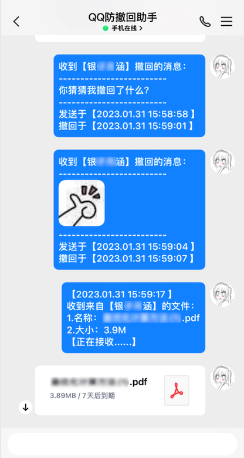
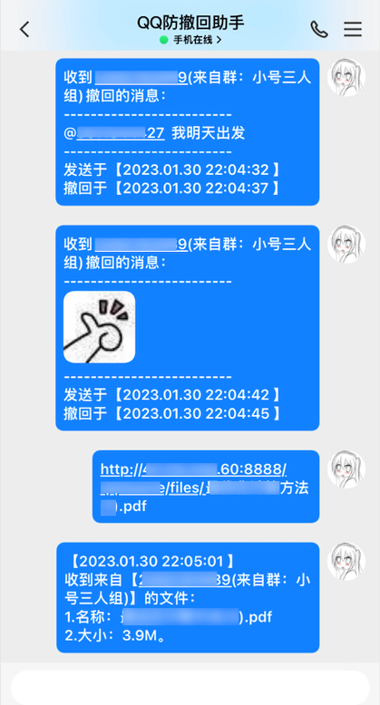
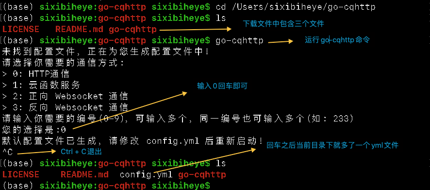
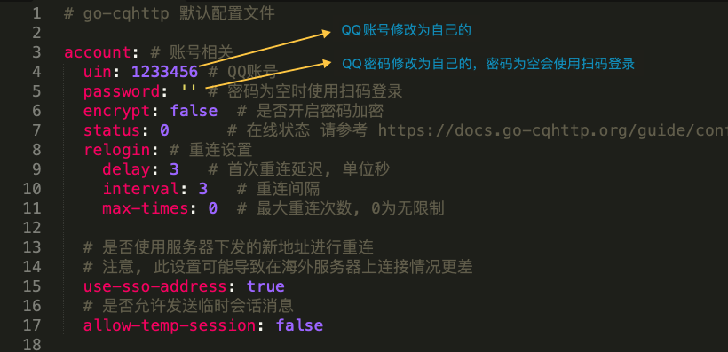
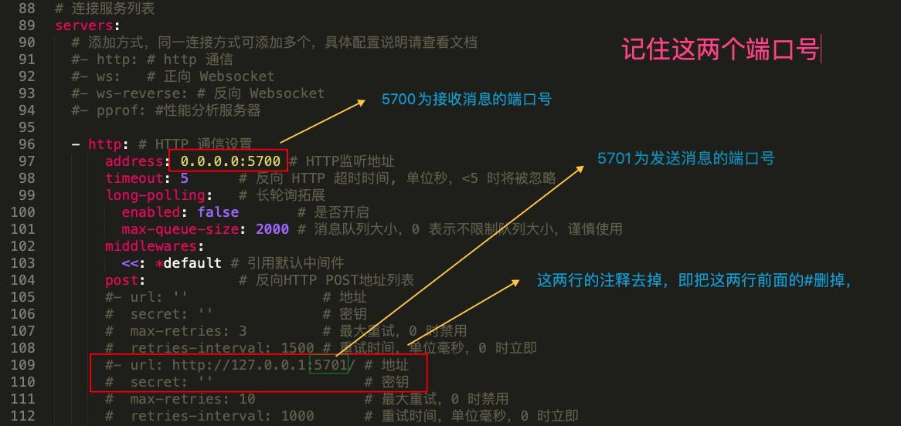

# qqbot 说明文档

本项目基于go-cqhttp，为QQ开发一个消息防撤回插件。  
注：由于基架构go-cqhttp已停止维护，本项目已于2024年2月16日停止维护。

## 项目简介

***项目功能***：保存QQ好友撤回的文本消息、图片消息、文件，将其发送至另一QQ好友（小号）。  

***项目版本***：2.1.0  

***项目技术基础***：go-cqhttp(v1.0.0-rc4)   

***项目部署服务器***：CentOs 7.x（其他服务器自行部署）

***项目语言***：python >= 3.8.0  

## 项目结构说明 
***config.ini***：项目配置文件，配置详情见后文    
***logger.log***：日志文件（自动生成）  
***loggertool***：日志处理工具类  
***main.py***：项目入口程序  
***qqapi.py***：功能实现核心api    
***README.md***：项目说明文档  


## 功能展示

项目自动将QQ好友撤回的消息转发至目标QQ号。到目前，支持的数据形式有：  
1. ***文本消息***（包含QQ表情）  
2. ***图片消息***（包括表情包和本地图片）
3. ***图文消息***（图片与文字混合）
4. ***视频消息***
5. ***文件***

其样例如下：  

私发消息撤回拦截： 

  

群消息撤回拦截：  



## 项目部署指南  

本项目基于go-cqhttp，需要先对go-cqhttp进行配置。  

***go-cqhttp的官网***   

<https://docs.go-cqhttp.org>  

下载文件解压后执行下述命令：  

    

修改配置文件config.yml：  

   
  

至此go-cqhttp服务配置完毕。  

配置好go-cqhttp之后，再来配置本项目。

### 拉取项目

首先使用***git***命令拉取项目文件：  

`git clone https://github.com/ly-sixibiheye/qqbot.git`  

### 项目配置
接着修改配置项目文件，配置文件为***config.ini***。  

```ini
[server]
# 为实时看到QQ消息，项目将撤回消息统一转达给另一QQ号，此处可修改为自己的小号
my_qq = 12345678

# 部署的服务器的公网IP，修改为自己服务器的公网IP
server_ip = 127.0.0.1

# 本地IP，一般不作修改
local_ip = 127.0.0.1

# go-cqhttp服务接收消息的端口，与go-cqhttp的配置文件保持一致
receive_server_port = 5700

# go-cqhttp服务发送消息的端口，与go-cqhttp的配置文件保持一致
send_server_port = 5701

# 一次接收go-cqhttp数据包的最大大小
once_max_recv = 4096

# 文件中转路径，服务器上暂存的文件路径，自行修改
file_middle_path = /home/qqchat/qqfiles

# 文件是否缓存在服务器上，为true时会自动删除，其余时不会
delete_middle_file = true


[logger]
# 日志文件名，自行设置
handler_file_name = logger.log

# 日志文件输出级别，自行设置
file_handler_level = DEBUG

# 控制台日志输出级别，自行设置
stream_handler_level = ERROR

```  

配置完成后，在服务器上后台运行本项目即可。参考命令：  

1. nohup go-cqhttp > /dev/null &
2. nohup python ./main.py > ./message.txt &  

命令中日志存储文件路径自行设置，注意main.py启动文件的路径。

至此项目部署完毕。


